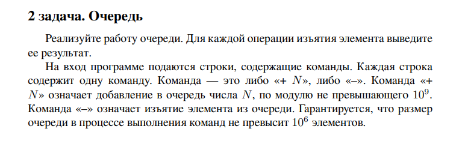
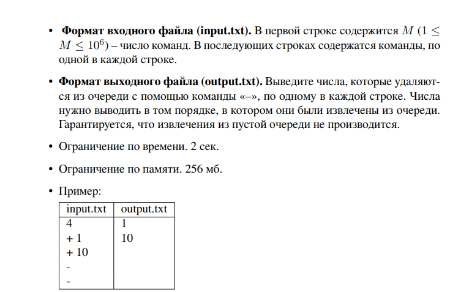

# Задание 2

Студент ИТМО: Афанасьев Дмитрий Михайлович  465071

## Вариант 2

## Задание 





## Ограничения по времени и памяти

- Ограничение по времени. 2сек.
- Ограничение по памяти. 256 мб.


## Запуск проекта
1. Клонируйте репозиторий:
   ```bash
    git clone https://github.com/Dima51Al/algorithms-and-data-structures
   ```
2. Перейдите в папку с проектом:
   ```bash
   cd algorithms-and-data-structures/lab4
   ```
3. Запустите программу:
   ```bash
   python src/main.py
   ```


## Тестирование
Для запуска тестов выполните:
```bash
   pytest 
```